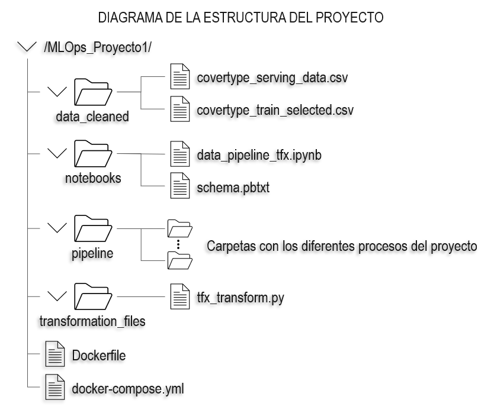
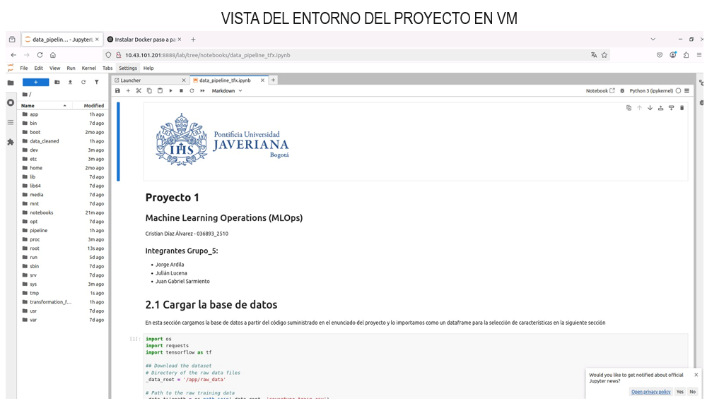

## Proyecto 1 (Nivel 0 - Nivel 1)

### Descripción del Proyecto

Este proyecto tiene como objetivo construir un entorno de desarrollo MLOps que permita la ingesta, validación y transformación de datos, además de versionar el código y garantizar la reproducibilidad del modelo de machine learning. Se trabaja con un conjunto de datos basado en "Tipo de Cubierta Forestal", el cual contiene variables cartográficas utilizadas para predecir la clasificación de la cobertura forestal.

### Herramientas Utilizadas

1. Docker y Docker Compose para la orquestación del entorno.

2. Python con librerías de machine learning como Scikit-learn y TensorFlow Extended (TFX).

3. Jupyter Notebook para la exploración y documentación del pipeline.

4. GitHub para versionamiento del código.

5. ML Metadata (MLMD) para el seguimiento del flujo de datos.

### Estructura del Proyecto

### Acceso al proyecto

El proyecto se montó sobre una de las máquinas virtuales facilitadas a los miembros del equipo de trabajo, por consiguiente, para acceder al proyecto y probar su funcionamiento, se sugiere acceder a la siguiente URL: [http:10.43.101.201:8888/lab?token=ceda0a6e5081c55ea3e2a4e06f3c61be585babfd25d0edc9 ](http://10.43.101.201:8888/lab?token=ceda0a6e5081c55ea3e2a4e06f3c61be585babfd25d0edc9)

En la siguiente imagen se observa el funcionamiento del proyecto corriendo sobre la máquina virtual desde la cual se desarrolló e implementó el proyecto:

Por último se recomienda revisar el notebook "data_pipeline_tfx.ipynb" para obtener la información detallada de cada paso realizado en el proyecto.
