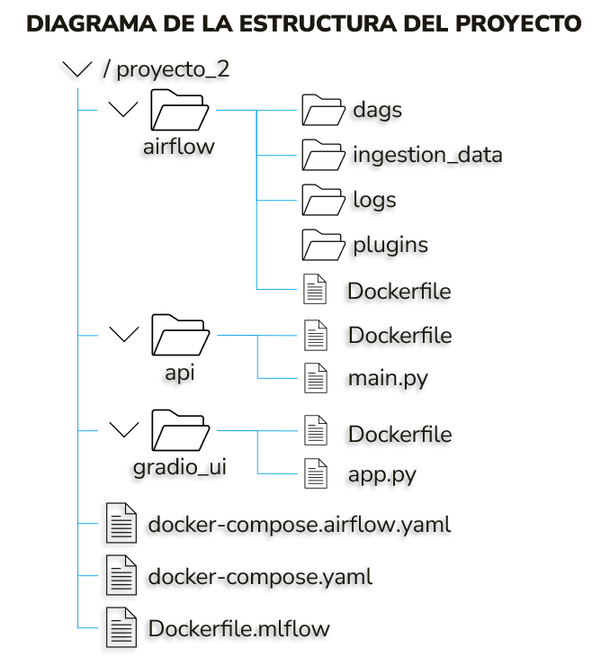
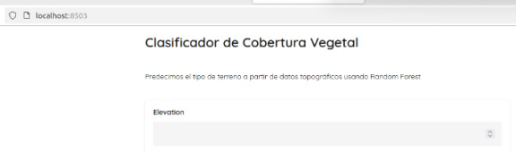
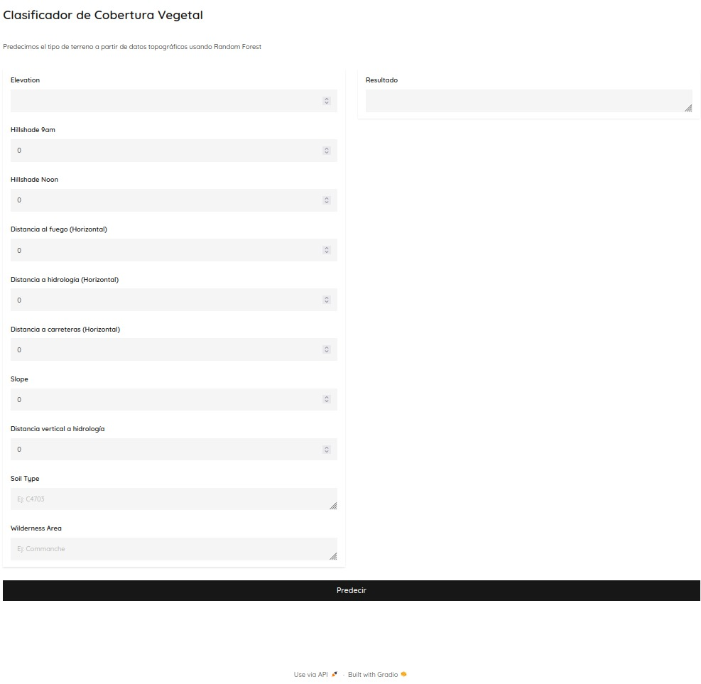

## PROYECTO 2
## Nivel 2 
## Orquestación, métricas y modelos

## DESCRIPCIÓN

El objetivo de este proyecto fue implementar una solución completa de MLOps desplegada en una máquina virtual, utilizando herramientas modernas del ecosistema de ciencia de datos y aprendizaje de máquina. El sistema fue desarrollado utilizando contenedores Docker y coordinado mediante Docker Compose, permitiendo la integración y automatización de los siguientes componentes:

-	Airflow: para la orquestación y programación de flujos de trabajo.
-	MLflow: para el seguimiento, registro y versionado de experimentos y modelos (experimentos, métricas y modelos).
-	Minio: como sistema de almacenamiento de objetos compatible con S3 para alojar artefactos generados durante el entrenamiento para MLflow.
-	MySQL: como base de datos para almacenar la metadata generada por MLflow.
-	FastAPI: para exponer un servicio REST que sirva el modelo entrenado
-	Gradio: para ofrecer una interfaz gráfica simple de inferencia para usuarios finales.

El sistema recolecta datos desde una API externa que entrega batches aleatorios cada cinco minutos, los utiliza para entrenar un modelo de clasificación y permite realizar predicciones sobre nuevas instancias en tiempo real.

## ESTRUCTURA DEL PROYECTO

La arquitectura fue desarrollada siguiendo el paradigma de microservicios, es decir que, los servicios están organizados como microservicios independientes, donde cada componente corre en su propio contenedor Docker y se comunica con los demás a través de una red virtual compartida
denominada general-net. Cada componente cumple una función especializada dentro del ciclo de vida del proyecto.

La solución se compone de dos archivos principales de configuración: docker-compose.yaml, que define los servicios para MLflow, Minio, MySQL, FastAPI y Gradio; y docker-compose.airflow.yaml, que define la pila de Airflow con sus componentes (scheduler, webserver, worker, triggerer, redis y postgres).

Todos los servicios están definidos para iniciarse de forma coordinada, y los datos se comparten entre contenedores mediante volúmenes.

## DESCRIPCIÓN DE COMPONENTES

### Airflow (orquestador)

Airflow se configuró usando CeleryExecutor, permitiendo la ejecución distribuida de tareas. La base de datos usada es PostgreSQL y el sistema de colas es Redis. Esta configuración, permite:

-	Automatizar la recolección periódica de datos desde la API externa (cada 5 minutos).
-	Disparar pipelines de entrenamiento, evaluación y registro en MLflow.
-	Guardar logs, DAGs y artefactos temporalmente en volúmenes compartidos.

El servicio se despliega con los siguientes componentes:

-	airflow-init: inicializa la base de datos y crea el usuario administrador.
-	airflow-webserver: interfaz gráfica en el puerto 8080 para monitorear los DAGs.
-	airflow-scheduler: programa la ejecución de tareas.
-	airflow-worker: ejecuta tareas en segundo plano.
-	airflow-triggerer: maneja sensores y tareas asincrónicas.

El DAG desarrollado en este entorno se encarga de hacer peticiones a la API externa cada cinco minutos para recolectar los datos, almacenarlos localmente y ejecutar el proceso de entrenamiento, evaluación y registro del modelo usando MLflow.

### MLflow

MLflow fue configurado para:

-	Almacenar metadatos en una base de datos MySQL.
-	Guardar artefactos de los experimentos y modelos en un bucket Minio con protocolo S3.
-	Exponer el servidor de seguimiento en el puerto 5000.
-	Registrar métricas de entrenamiento, parámetros del modelo y artefactos serializados.
-	Versionar los modelos e identificar el mejor modelo para ser utilizado en producción.

Los modelos se registran en el MLflow Model Registry y se les asigna la etapa "Production" para ser consumidos posteriormente.

### Minio

Minio actúa como repositorio de almacenamiento de objetos compatible con S3. Se utiliza para:

-	Almacenar artefactos de modelos.
-	Proveer un backend S3 compatible con MLflow.
-	Archivos de entrenamiento.
-	Archivos de configuración de experimentos.

Está expuesto en los puertos 9000 (API) y 9001 (consola administrativa).

### MySQL

La base de datos MySQL almacena la información relacionada con los experimentos de MLflow, incluyendo:

-	Métricas obtenidas durante entrenamiento.
-	Parámetros de ejecución.
-	Resultados de ejecuciones.
-	Estados de los modelos registrados.

Se ejecuta en el puerto 5433 para evitar colisiones con PostgreSQL de Airflow.

### FastAPI

El servicio FastAPI expone una API REST (/predict/), la cual está diseñada para recibir peticiones HTTP POST (JSON) con las características de entrada para el modelo. Internamente:

-	Carga automáticamente el último modelo en etapa "Production" desde MLflow.
-	Realiza la predicción usando el modelo cargado.
-	Definir un esquema de entrada con las variables requeridas.
-	Realizar preprocesamiento básico como escalamiento y codificación de variables categóricas.
-	Ejecutar la predicción y retornar el tipo de cobertura forestal.

Está disponible en el puerto 8000.

### Gradio (Interfaz Gráfica)

Gradio ofrece una interfaz sencilla para que usuarios puedan ingresar datos manualmente y visualizar la predicción devuelta por la API FastAPI. Se ejecuta en el puerto 8503 y hace peticiones HTTP al endpoint /predict/ de FastAPI. En la siguiente imagen se aprecia la ejecución de la interfaz en el puerto configurado:

-	Campos para ingreso de variables numéricas y categóricas.
-	Conexión directa con la API de inferencia para mostrar el resultado en pantalla.

## RECOLECCIÓN DE DATOS

Airflow gestiona la recolección periódica de los datos accediendo a la API externa cada cierto tiempo. El DAG implementado en Airlfow se asegura de capturar muestras de cada batch antes de su vencimiento (cada 5 minutos), y se encarga de:

-	Hacer peticiones HTTP para recolectar cada porción del batch.
-	Guardar localmente los datos obtenidos.
-	Unir los datasets hasta completar los 10 subconjuntos requeridos.
-	Lanzar el proceso de preprocesamiento y entrenamiento una vez se alcanza la muestra mínima necesaria
Esta recolección se realiza en paralelo con la lógica de limpieza, transformación y almacenamiento de los datos para que el flujo de MLOps pueda continuar sin intervención manual.

## ENTRENAMIENTO Y REGISTRO DE MODELOS

El entrenamiento se ejecuta de manera automatizada desde Airflow y documentado en MLflow, y una vez recolectados los datos, se realiza:

-	Selección de variables numéricas y categóricas.
-	Preprocesamiento con escalado estándar y codificación de etiquetas.
-	Entrenamiento de un modelo Random Forest.
-	Evaluación con métricas como accuracy, precision y matriz de confusión.
-	Registro del modelo, artefactos y métricas en MLflow.
-	Selección del mejor modelo y promoción a "Production".

## INFERENCIA

La inferencia se realiza por medio de una API REST implementada con FastAPI. El servicio FastAPI carga el modelo automáticamente desde MLflow y responde a solicitudes de predicción. Esta API:

-	Valida los datos recibidos.
-	Se conecta a MLflow y localiza el último modelo en estado "Production".
-	Ejecuta el mismo pipeline de preprocesamiento usado en el entrenamiento.
-	Devuelve el tipo de cobertura forestal como resultado de la predicción.

## INTERFAZ DE USUARIO

La interfaz Gradio sirve como una vista simple para que cualquier usuario pueda probar el modelo en tiempo real sin conocimientos técnicos. Esta interfaz permite:

-	Ingresar manualmente las cuatro características requeridas para la predicción.
-	Botón de predicción que consulta el endpoint REST.
-	Realizar pruebas sin necesidad de herramientas externas.
-	Visualizar en pantalla del resultado retornado por la API.

Esto facilita la validación del sistema y su uso por parte de personas no técnicas.

## CONCLUSIÓN

La solución implementada cumple con los requerimientos del proyecto y demuestra una integración efectiva de herramientas de MLOps modernas, desde la recolección de datos hasta la inferencia en tiempo real, siguiendo las mejores prácticas de arquitectura basada en microservicios y contenedores. El uso de Docker Compose facilitó la gestión integrada de los componentes y permitió una integración fluida entre ellos.

## EJECUCIÓN DEL PROYECTO

El proyecto quedó montado completamente en la máquina virtual con dirección ip: 10.43.101.165

La API para la ingesta de datos quedó montada en la máquina virtual con dirección ip: 10.43.101.201 en el puerto 80
