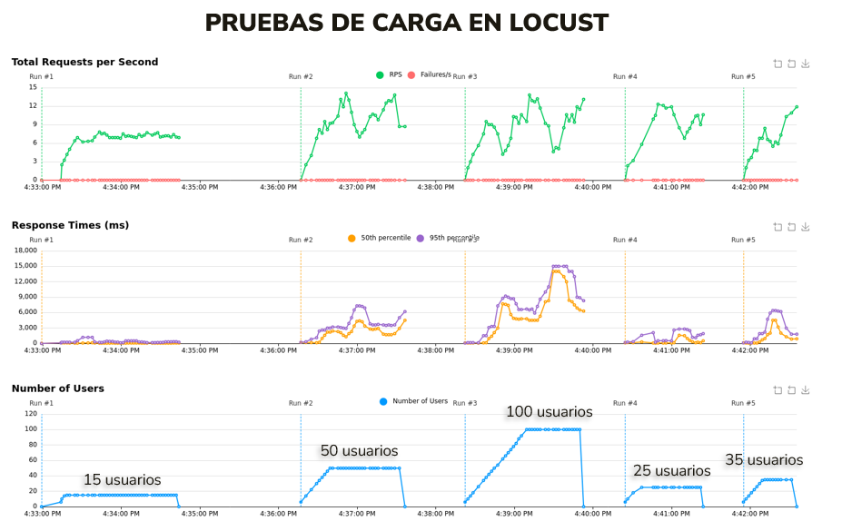

## PROYECTO 3
## Nivel 3
## Kubernetes

## DESCRIPCIÓN

Este proyecto implementa una arquitectura MLOps completa desplegada sobre una única máquina virtual actuando como clúster Kubernetes, permitiendo la automatización y orquestación de un sistema de Machine Learning end-to-end. El objetivo es facilitar un flujo continuo desde la recolección de datos hasta el monitoreo y escalamiento de la inferencia, simulando un entorno de producción realista. Se utilizó Docker y Kubernetes para aplicar la filosofía de contenedores en cada componente, asegurando modularidad y replicabilidad.

## OBJETIVOS DEL PROYECTO

-	Automatizar el flujo completo de un sistema de machine learning con MLOps utilizando herramientas de nivel industrial.

-	Ejecutar procesos periódicos de entrenamiento utilizando DAGs de Airflow.

-	Registrar los resultados de cada ejecución en MLflow, incluyendo hiperparámetros, métricas, artefactos y versiones de modelo.

-	Usar MLflow para gestionar versiones de modelo y designar automáticamente el mejor como "Production".

-	Proveer una API RESTful y una interfaz gráfica que permitan consumir el modelo de producción sin necesidad de cambios en el código.

-	Establecer un sistema de monitoreo y observabilidad con Prometheus y Grafana.

-	Simular carga y estimar la capacidad máxima de usuarios concurrentes mediante Locust.

## ESTRUCTURA DEL PROYECTO

La estructura del repositorio se diseñó para facilitar el despliegue modular de cada componente. Cada carpeta contiene los scripts y archivos necesarios para ejecutar su respectivo servicio.

Por otro lado, En Docker Hub, se almacenan los repositorios de imágenes que han sido incluidas en contenedores utilizados en el Proyecto. En este contexto del proyecto, en la siguiente imagen se permite apreciar que cada uno de los componentes del sistema fue empaquetado como una imagen Docker personalizada, subida al repositorio público/privado del usuario en Docker Hub:

Los nombres de los repositorios reflejan claramente la segmentación funcional del sistema:

proyecto_3_mlflow: servidor de MLflow.

custom_airflow: servidor Airflow con DAGs definidos para orquestación.

proyecto_3_fastapi: servicio de inferencia via API REST.

proyecto_3_gradio: servicio de interfaz gráfica con Gradio.

## FLUJO DE TRABAJO MLOPS

### 1. Recolección y Procesamiento de Datos

Se crearon múltiples DAGs en Airflow para automatizar la ingesta y transformación de los datos:

-	load_raw_data.py: Descarga el archivo csv del link de internet y lo guarda en la base de datos MySQL en la tabla 'raw_data'
-	load_train_data.py: Carga progresiva en lotes de 15.000 registros del conjunto de entrenamiento desde 'raw_data' a la tabla 'train data'
-	load_val_test_data.py: Carga en un solo proceso de los conjuntos de validación y prueba en 'validation_data' y 'test_data'
-	process_data.py: Limpieza y selección de características de cada uno de los subconjuntos, guardados en 'train_data_cleaned', 'validation_data_cleaned' y 'test_data_cleaned'
-	train_model.py: Ejecución de 10 experimentos de entrenamiento de un clasificador Random Forest con hiperparámetros aleatorios
-	promote_best_model.py: Promueve al mejor modelo registrado en Mlflow a producción utilizando el "tag=best_model"

Cada ejecución se encuentra y puede ser monitoreada desde la interfaz de Airflow.

### 2. Entrenamiento y Registro de Modelos

-	Los modelos se entrenan usando el DAG train_model.py.
-	Se registra cada ejecución en MLflow, incluyendo:
  -	AUC, Precisión, Recall.
  -	Artefactos como el modelo serializado (.pkl) y gráficas de evaluación.
-	El mejor modelo (por AUC) se promueve automáticamente a "Production" usando el DAG promote_best_model.py, desde el cual se etiqueta (TAG) con ‘true’ en el campo ‘best_model’ aquel modelo que posee el mejor rendimiento (accuracy).
- MLflow está configurado con PostgreSQL para los metadatos y MinIO como bucket S3 para artefactos.

En la siguiente imagen se muestra los modelos entrenados y como es etiquetado el modelo con mejor desempeño como best_model:

### 3. API para Inferencia (FastAPI)

-	Implementada en un contenedor independiente.
-	Expone dos endpoints:
 /predict: Recibe datos, consulta a MLflow el modelo en producción y retorna la predicción.
 /metrics: Expuesto para Prometheus. Incluye latencia, conteo de peticiones y errores.

Los mencionados endpoints se aprecian en la siguiente imagen:

El código es genérico y el modelo activo se selecciona mediante la búsqueda de tags en mlflow correspondiente al mejor modelo, lo que elimina la necesidad de actualizaciones manuales del código al cambiar de versión.

### 4. Interfaz de usuario (UI) con Gradio

-	Construida para facilitar el ingreso de valores por parte del usuario.
-	Permite probar rápidamente predicciones y ver qué versión de modelo fue usada.
-	El archivo ui/app.py contiene el código de la interfaz, que se conecta con la API de FastAPI.

Ejemplo de cómo se ve la interfaz de usuario creada y en funcionamiento:

### 5. Observabilidad

-	Prometheus recolecta métricas expuestas por FastAPI (tiempo de respuesta, volumen, errores).
- Grafana despliega dashboards personalizados para:
    Serie de tiempo de latencia de respuesta
    Conteo de predicciones realizadas
    Conteo de predicciones por clase realizadas
- Configuración de dashboards en grafana/provisioning/.

En la siguiente imagen se observa el comportamiento del dashboard en Grafana el cual se actualiza en tiempo real, en la medida que se realizan nuevas inferencias en la interfaz de usuario:

### 6. Pruebas de Carga

Con Locust se simularon diferentes escenarios de usuarios concurrentes atacando el endpoint /predict.

Se midieron los siguientes KPIs:
-	RPS (requests per second)
-	Tiempo promedio de respuesta
-	Porcentaje de errores
-	Capacidad máxima sostenible antes de superar 20% de errores

## EVIDENCIAS DE LOCUST

•	Se ejecutaron cargas crecientes de 15, 25, 35, 50 y hasta 100 usuarios concurrentes.

A partir de la gráfica anterior, se evidencia que:

-	Rendimiento por segundo: el sistema fue capaz de mantener una tasa estable de 10-13 peticiones por segundo sin errores reportados (línea verde, sin puntos rojos).
-	Tiempo de respuesta:
-	La mediana (50th percentile) se mantuvo generalmente por debajo de los 3000 ms.
-	El 95th percentile presentó picos, pero en los rangos operativos bajos (hasta 25 usuarios) los tiempos fueron aceptables.
-	Número de usuarios: el sistema operó sin fallos hasta los 25 usuarios concurrentes, presentando tiempos de respuesta razonables y constantes.

Conclusión técnica: El sistema es estable y confiable hasta un máximo de 25 usuarios concurrentes, sin errores ni caídas del contenedor. Los tiempos de respuesta se mantuvieron por debajo de los 3 segundos incluso bajo esa carga. Más allá de ese umbral, comienzan a observarse incrementos significativos en la latencia y potenciales errores, por lo que se recomienda ajustar los recursos o escalar horizontalmente si se espera una mayor concurrencia.

## TECNOLOGÍAS Y SERVICIOS

Este ecosistema se construyó tomando como referencia el diagrama propuesto en el encunciado del proyecto, para lo cual, se usaron las siguientes herramientas:

-	Kubernetes sobre VM: cluster de un nodo ejecutado sobre una máquina virtual.
-	Docker Compose: para pruebas locales.
-	Apache Airflow: automatización de workflows y DAGs.
-	MLflow + MinIO + PostgreSQL: experiment tracking, gestión de modelos y artefactos.
-	FastAPI: API REST de inferencia.
-	Gradio: interfaz gráfica de usuario.
-	Prometheus + Grafana: monitoreo y dashboards.
-	Locust: pruebas de carga y rendimiento.

## SEGUIMIENTO Y MÉTRICAS

-	MLflow UI: http:/10.43.101.165:30500/
-	Grafana: http:/10.43.101.165:30300/ (usuario: admin/contraseña: admin)
-	Locust: http:/10.43.101.165:30889/

Cada experimento registrado puede visualizarse con sus respectivos parámetros, métricas y artefactos.

### CONCLUSIÓN

Este proyecto representa una implementación robusta de una arquitectura MLOps moderna, con todas las etapas del ciclo de vida (end-to-end) de un modelo de ML integradas de forma automática y observable. El uso de una única VM simula un entorno de despliegue económico y reproducible para escenarios académicos o prototipos profesionales. La modularidad y el uso de estándares abiertos aseguran portabilidad y escalabilidad futura. La inclusión de métricas, monitoreo y pruebas de carga posiciona esta solución como lista para producción en ambientes controlados.

### VIDEO DE SUSTENTACIÓN

En el siguiente enlace se incluye el video mediante el cual se sustenta el proyecto:

https://www.youtube.com/watch?v=-WlYubfFD9E

### REFERENCIAS

-	Airflow: https://airflow.apache.org/
-	MLflow: https://mlflow.org/
-	Streamlit: https://streamlit.io/
-	Prometheus: https://prometheus.io/
-	Grafana: https://grafana.com/
-	Locust: https://locust.io/
-	Dataset: https://doi.org/10.24432/C5230J

### EJECUCIÓN DEL PROYECTO

El proyecto quedó montado completamente en la máquina virtual con dirección ip: 10.43.101.165

El despliegue se realizó en una máquina virtual con microk8s. Los manifiestos YAML fueron definidos para cada componente.

Requisitos:
- Docker
-	Docker Compose
-	Kubernetes (microk8s)

Para el despliegue local, se ejecuta el siguiente comando para construir e iniciar todos los servicios:

$ docker-compose up --build 

Para el despliegue en Kubernetes, se ejecuta el siguiente comando para instalar microk8s en una sola máquina virtual:

sudo snap install microk8s --classic

sudo microk8s enable dns storage ingress

Luego, se ejecuta el siguiente comando, con la finalidad de aplicar manifiestos YAML desde la carpeta k8s/:

kubectl apply -f "nombre-del-archivo.yaml"

Acceder a la inferencia y dashboards a través de NodePort.

### Acceso:
-	MLflow UI: http:/10.43.101.165:30500/
-	MiniO UI: http:/10.43.101.165:30901/
-	API FastAPI: http:/10.43.101.165:30800/
-	Airflow UI: http:/10.43.101.165:30080/
-	Gradio UI: http:/10.43.101.165:30850/
-	Grafana: http:/10.43.101.165:30300/ (admin/admin)
-	Locust: http:/10.43.101.165:30889/
