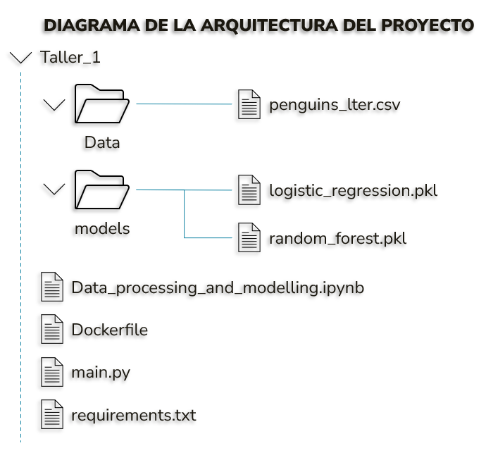
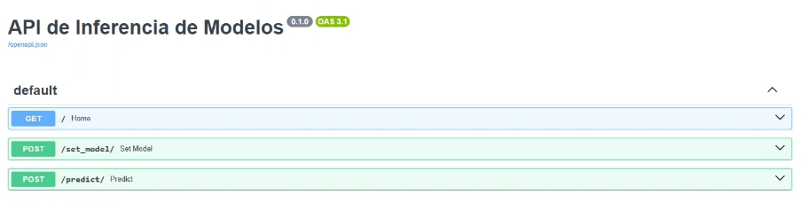
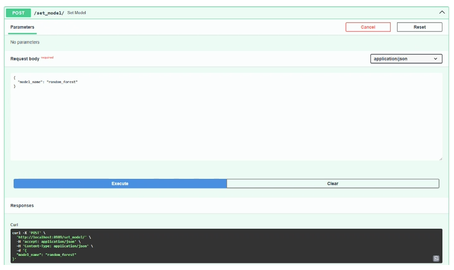
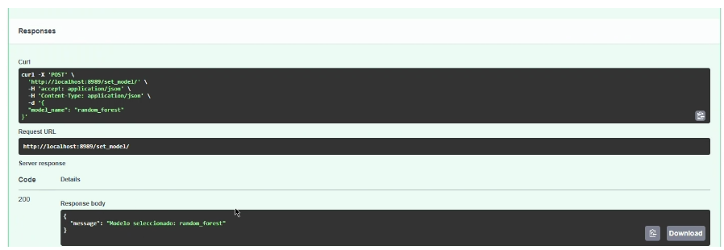
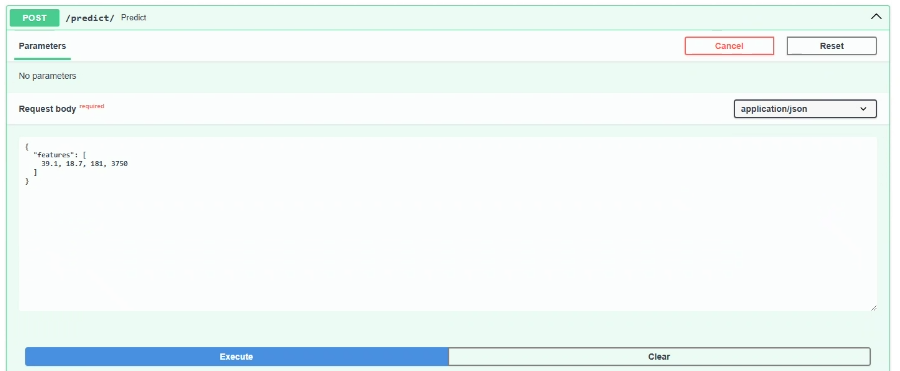
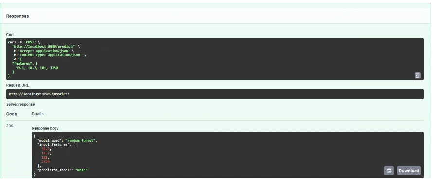

### Enunciado del taller:

Descargue los datos asociados en el aula virtual.

- Cree un archivo en Python consuma estos datos y realice las dos etapas, procesamiento de datos y creación de modelo. Considere usar como guía las sub-etapas listadas. 
- Cree un API usando FastAPI permita hacer inferencia al modelo entrenado.
- Cree la imagen del contenedor con el API creada. Exponga el API en puerto 8989.

Bono.

El proceso de entrenamiento de un modelo busca encontrar el mejor modelo y ajustarlo a los datos, este proceso de experimentación en ocasiones resulta en multiples modelos con muy buenos resultados. Como bono entregue en el API un método adicional que permita seleccionar cual modelo será usado en el proceso de inferencia.

## Resolución del taller:

### INTRODUCCIÓN

En este taller, se ha diseñado la arquitectura de un proyecto que responde al enunciado planteado, aplicando los conceptos aprendidos en clase. En la siguiente imagen se aprecia la estructura del proyecto, la cual será descrita en una sección más adelante:

### GENERALIDADES DEL PROYECTO

Como primera medida se realizó la exploración del conjunto de datos entregado por el profesor. A partir de ello, se decidió qué con algunas características se pudiese predecir el sexo del animal (en este caso pingüinos, de acuerdo con el conjunto de datos), por lo tanto, se determinó que un modelo de clasificación binaria rezpondería adecuadamente a esta necesidad, y también porque los datos son de tipo estructurados.

Así las cosas, el proyecto se estrucutró a partir de tres etapas fundamentales:

1. Procesamiento de Datos y Entrenamiento del Modelo.

2. Implementación de la API para hacer inferencias (FastAPI).

3. Despliegue de la API en un contenedor para un usuario (Docker).

### ARQUITECTURA DEL PROYECTO

La arquitectura del proyecto está basada en las etapas enunciadas anteriormente, la cual se compone de tres módulos:

## 1. Procesamiento de Datos y Entrenamiento del Modelo

Es este módulo principlamente se realizó lo siguiente:

a. Se hizo el cargue del conjunto de datos, posteriormente, en la exploración de los datos.
b. Se realizó un preprocesamiento que incluye la limpieza de datos y selección de características relevantes. Teniendo en cuenta que se va a predecir el sexo del pingüino, se determinó hacerlo con base en cuatro variables, a saber,'Culmen Length (mm)', 'Culmen Depth (mm)', 'Flipper Length (mm)', Body Mass (g). Estas variables hacen referencia al tamaño y grosor del pico, a la longitud de la aleta y al peso del animal.
c. Se seleccionó modelos de clasificación binaria utilizando algoritmos de Machine Learning, como Regresión Logística. Y para responder al bono del taller, se eligió como algoritmo adicional, Random Forest.
e. Una vez entrenados los modelos, se guardaron en un archivo (*.pkl) para su posterior uso desde la API.

## 2. Implementación de la API (FastAPI)

Las actividades principales de este módulo, fueron:

a. Se creó una API utilizando el framework FastAPI.

Vista de la API desde el browser:

b. Se definió un endpoint (/predict/) que permite recibir datos en formato JSON, elegir manualmente uno de los modelos entrenados y luego, devolver la predicción basada en la entrada de los datos del usuario. Las entradas también deben ser introducidas manualmente por el usuario, y en el siguiente orden: Tamaño (mm) y grosor del pico (mm), a la longitud de la aleta (mm) y al peso del animal (gramos).

Elección manual del modelo:

Confirmación de la elección del modelo:

## 3. Contenedor y Despliegue

A continuación, se resumen los pasos importante realizados en este módulo:

a. Se creó un archivo Dockerfile que define la imagen del contenedor, aplicando lo aprendido en clase.

b. Se incluyen las dependencias que luego se instalaran (ejm. Python, librerías, etc.) y se configura el servidor para ejecutar la API en el puerto 8989.

c. Se genera la imagen del contenedor y se despliega en un servidor accesible (localhost).

d. Se establece una conexión para uso del usuario mediante el navegador web y desde allí se introducen los datos que consumen las predicciones del modelo.

Introducción de los datos de entrada por parte del usuario:

Predicción del modelo:

