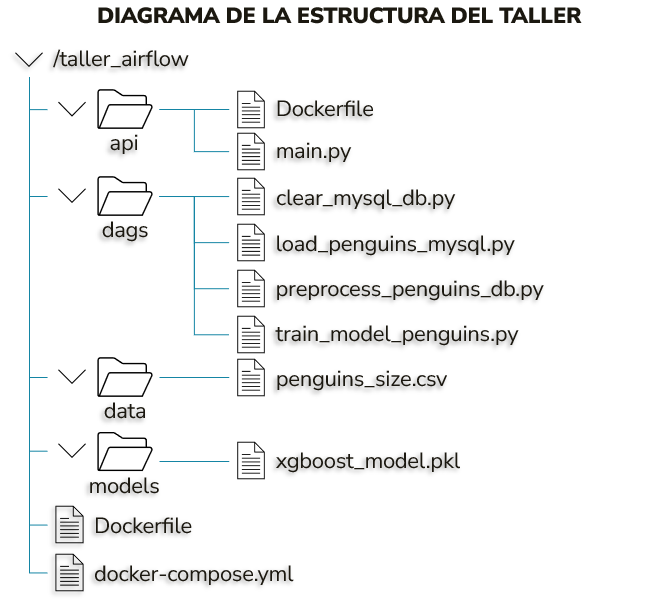
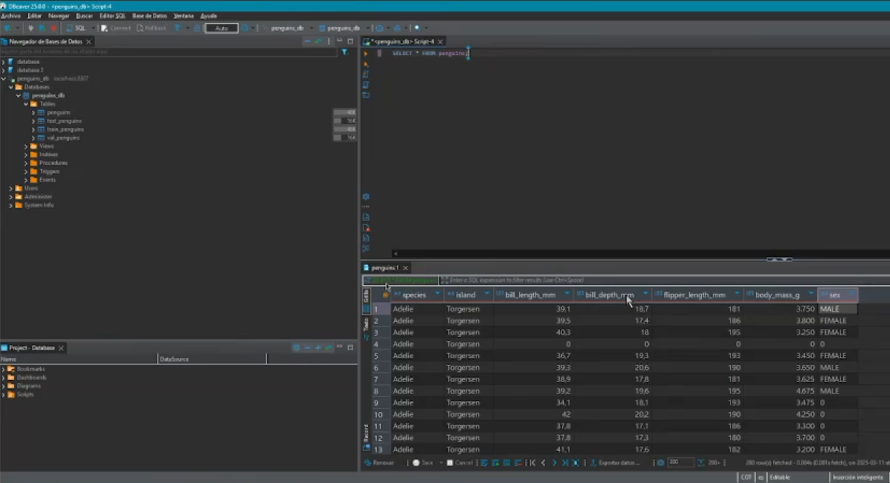

## Resolución del taller Airflow:

## DESCRIPCIÓN

Este proyecto implementa un flujo de trabajo basado en Airflow utilizando Docker Compose para gestionar la ingestión, procesamiento y entrenamiento de un modelo de predicción de características de pingüinos. Además, se expone una API para realizar inferencia con el modelo entrenado.

## ESTRUCTURA DEL PROYECTO

### Componentes Principales

1.	Base de Datos MySQL
-	Se levanta un contenedor con MySQL que almacena los datos de pingüinos.
-	Configurado en docker-compose.yml con usuario y base de datos específica.
2.	Airflow
-	Implementado con Celery Executor y utilizando PostgreSQL (lo dejamos implementado en caso de que se requiriera) como backend.
-	Contiene los DAGs necesarios para el procesamiento de datos y entrenamiento del modelo.
3.	DAGs de Airflow
-	clear_mysql_db.py: Limpia la base de datos MySQL antes de la carga de datos.
-	load_penguins_mysql.py: Carga los datos sin preprocesamiento desde la carpeta data y carga el archivo penguins_size.csv a MySQL.
-	preprocess_penguins_db.py: Realiza el preprocesamiento de los datos.
-	train_model_penguins.py: Entrena un modelo de XGBoost con los datos preprocesados.
4.	API de Inferencia
-	Desarrollada en FastAPI (api/main.py).
-	Permite realizar predicciones usando el modelo entrenado.
-	El modelo xgboost_model.pkl se almacena en el volumen compartido ./models/.

## IMPLEMENTACIÓN DEL PROYECTO

Para la implementación del Docker Compose, se creó un archivo docker-compose.yaml, el cual define una infraestructura basada en contenedores para ejecutar Airflow, una base de datos MySQL, un servidor Redis, y una API de inferencia. 

Es decir que, Docker Compose crea una infraestructura modular y escalable para el entrenamiento de modelos, orquestación con Airflow e inferencia a través de la API.

A continuación se muestra un fragmento del archivo docker-compose.yaml creado para el taller, específicamente en la sección de la configuración del servicio MySQL:

## EJECUCIÓN DEL TALLER

Para ejecutar la solución implementada del taller, se debe primero ejecutar los siguientes comandos:

mkdir ./dags ./logs ./plugins

sudo chmod -R 777 .

El primer comando, crea tres directorios (dags, logs y plugins) en la ubicación actual. Y el segundo, cambia los permisos de todos los archivos y subdirectorios dentro del directorio actual.

Esta acción es necesaria debido a que, durante la elaboración del taller, el equipo enfrentó diversas dificultades que generaban errores. Tras investigar y realizar pruebas, se identificó como solución la ejecución de estas dos líneas de comando, lo que permitió completar satisfactoriamente el taller.

A continuación, se debe ejecutar la siguiente línea de comando, la cual construye las imágenes con las configuraciones específicas de cada servicio y prepara todos los contenedores para su ejecución, basándose en la configuración definida en Docker Compose:

docker-compose up --build

Finalmente, para acceder a los servicios se recomienda usar las siguientes URL’s:

-	Para la interfaz de Airflow (Airflow UI): http://localhost:8080/ (Usuario: airflow, Contraseña: airflow)

-	Para la inferencia del modelo (FastAPI): http://localhost:8000/docs 

### DESARROLLO DE LA API CON FASTAPI

La API de inferencia fue desarrollada con FastAPI para gestionar solicitudes de predicción mediante el modelo xgboost_model.pkl, almacenado en la carpeta models. Este modelo se diseñó para generar inferencias a partir de los datos de entrada. La implementación se basa en la entrega previa del taller de API.

### Inferencia de Datos

Las entradas deben ser introducidas manualmente por el usuario y de allí se realiza la predicción mediante el modelo Xgboost implementado. Los datos de entrada que se requieren son: Tamaño (mm) y grosor del pico (mm), a la longitud de la aleta (mm) y al peso del animal (gramos).

## PRUEBAS DURANTE LA IMPLEMENTACIÓN
Durante la implementación de este taller, el equipo utilizó herramientas adicionales para verificar el correcto funcionamiento de las tareas programadas en los DAGs. Aunque la interfaz de Airflow permite visualizar ciertos detalles, estos se limitan a la ejecución de las tareas dentro de los DAGs, sin mostrar explícitamente los resultados obtenidos por dichas tareas.

En este contexto, se optó por utilizar DBeaver, una aplicación cliente de SQL y herramienta de administración de bases de datos. Su propósito en el presente taller fue validar la correcta ejecución de los DAGs de cargue y preprocesamiento. Para ello, se verificó que la base de datos cruda (penguins_size.csv) se cargara correctamente y que la estructura de la base de datos generada con el servicio MySQL (penguins_db) reflejara adecuadamente los datos preprocesados.

Para acceder a la base de datos, se requieren las siguientes credenciales:

penguins_db (Usuario: user, Contraseña: password)

