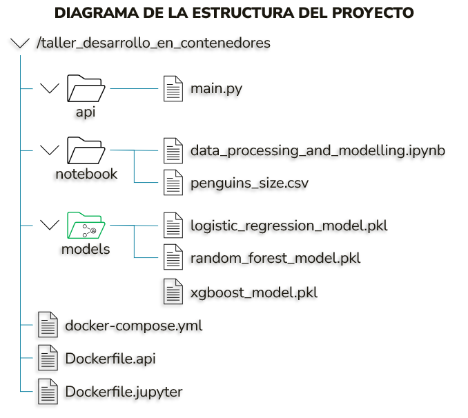
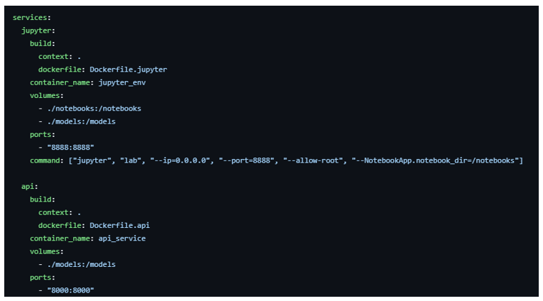
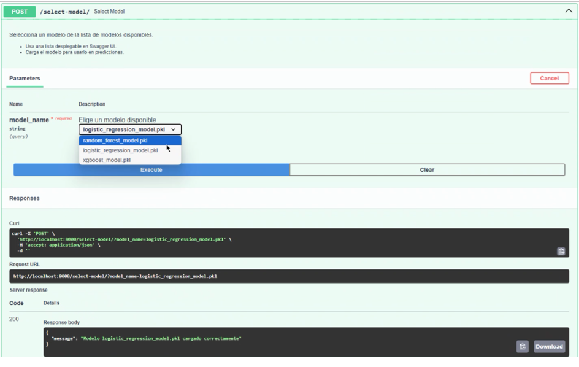
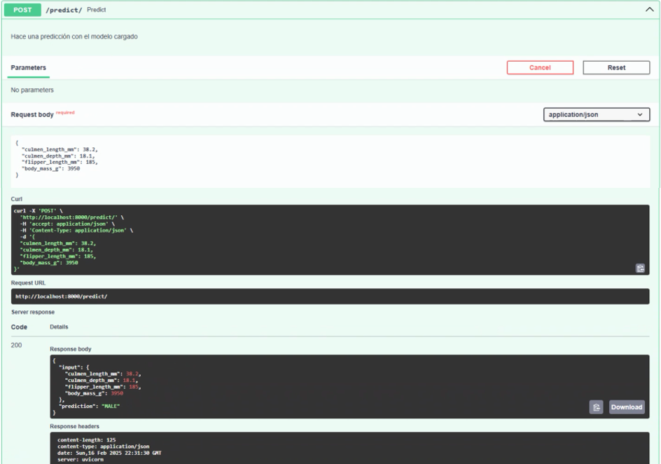

## Resolución del Taller de Desarrollo en Contenedores:

### INTRODUCCIÓN

En este informe se documenta la integración de uv en un entorno de desarrollo basado en Docker Compose para la gestión eficiente de dependencias en un proyecto de Machine Learning. Se han configurado servicios que incluyen JupyterLab, entrenamiento de modelos y una API para la inferencia, todo dentro de un ecosistema de contenedores interconectados. En la siguiente imagen se aprecia la estructura del proyecto, la cual será descrita en una sección más adelante:

### GENERALIDADES DEL PROYECTO

Para responder al enunciado planteado de este taller, se trazó como objetivo principal la creación de un entorno de desarrollo que permita:

-	Ejecutar JupyterLab utilizando uv para la gestión de dependencias.

-	Entrenar modelos de Machine Learning en Jupyter y almacenarlos en un volumen compartido.

-	Implementar una API que consuma los modelos entrenados para realizar inferencias.

-	Desplegar todos los servicios mediante Docker Compose.

### ARQUITECTURA DEL PROYECTO

El entorno de desarrollo se compone de los siguientes servicios:

1.	JupyterLab con uv: Usado para el desarrollo y entrenamiento de modelos.

2.	API de inferencia: Servicio que permite el consumo de modelos entrenados.

3.	Volumen compartido: Almacena los modelos entrenados para que puedan ser accesibles desde la API. Para este caso en particular, es volumen compartido se configuró para la carpeta ‘/models’.

Estos componentes se encuentran definidos en Docker Compose, asegurando que cada servicio se comunique adecuadamente y que los modelos puedan ser utilizados sin necesidad de movimientos manuales de archivos, además, en la medida que se entrenen nuevos modelos, se actualizará el listado de modelos disponibles e incluirá los nuevos modelos, los cuales podrán ser elegidos por el usuario en la interfaz de Swagger UI (localhost:8000/docs).

Esto último, se logra a partir del endpoint @app.get("/models"), cuyo funcionamiento permite que cuando se entrene y guarde un nuevo modelo en la carpeta ‘/models’, el citado endpoint lo detectará automáticamente sin necesidad de reiniciar la API.

Para la implementación del Docker Compose, se creó un archivo docker-compose.yml que define los servicios de Jupyter y de la API, y los volúmenes compartidos de ambos servicios, como se observa a continuación:

En la imagen anterior se aprecia que se usó el volumen llamado ‘/models’ para acceder a los modelos entrenados desde ambos servicios. Por otro lado, se exponen los puertos para cada servicio, a saber, de Jupyter (8888) y la API (8000).

### DESARROLLO DE LA API CON FASTAPI

La API de inferencia fue implementada utilizando FastAPI para gestionar peticiones de predicción. Se desarrolló un endpoint que permite la selección de modelos entrenados y otro para realizar inferencias a partir de datos de entrada.

## Selección de Modelos

Se implementó un endpoint /select-model/ que permite el uso de una lista desplegable y seleccionar un modelo entrenado desde la carpeta compartida.

## Inferencia de Datos

El endpoint /predict/ permite recibir datos en formato JSON y retornar la clasificación correspondiente según el modelo cargado. Las entradas también deben ser introducidas manualmente por el usuario, y en el siguiente orden: Tamaño (mm) y grosor del pico (mm), a la longitud de la aleta (mm) y al peso del animal (gramos).

### PRUEBAS Y VALIDACIÓN

Se lanza el comando docker compose build, cuya función es: 

1.	Buscar los archivos Dockerfiles Dockerfile.jupyter y Dockerfile.api, para los servicios de Jupyter y la API, respectivamente. 
2.	Construir las imágenes con las configuraciones de cada servicio. 
3.	No inicia los contenedores, solo los prepara para ser ejecutados.

Luego, se lanza el comando docker compose up -d, el cual:

1. Levanta los servicios (Jupyter y API) en segundo plano sin bloquear la terminal.
2. Monta el volumen /models para acceder a los modelos entrenados en Jupyter y compartidos para acceso de la API.
3. Ejecuta los comandos de inicio de cada servicio (Jupyter Lab en jupyter_env y el servidor de la API en api_service).
4. Permite acceder a JupyterLab (http://localhost:8888) y a la API (http://localhost:8000/docs).

Para acceder a JupyterLab, es importante tener en cuenta que se requiere un token de acceso. Para ello se debe ejecutar el comando docker logs jupyter_env, y de allí se podrá copiar el token para luego pegarlo en la ventana del navegador donde se encuentra la URL http://localhost:8888.

Finalmente, se incorporó Swagger UI para facilitar el uso y prueba de los endpoints. En ese sentido, se ejecuta la dirección http://localhost:8000/docs/ en una ventana del navegador, y de allí se realizan las pruebas:

1.	La selección y carga de modelos.

2.	La inferencia correcta de datos de entrada.

