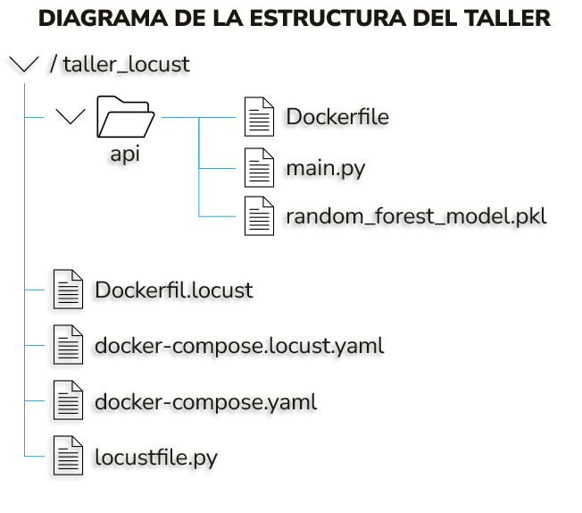
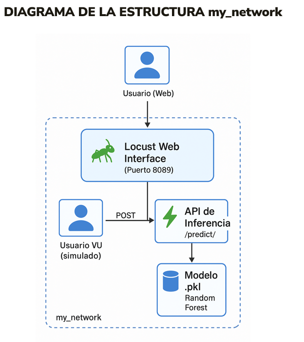
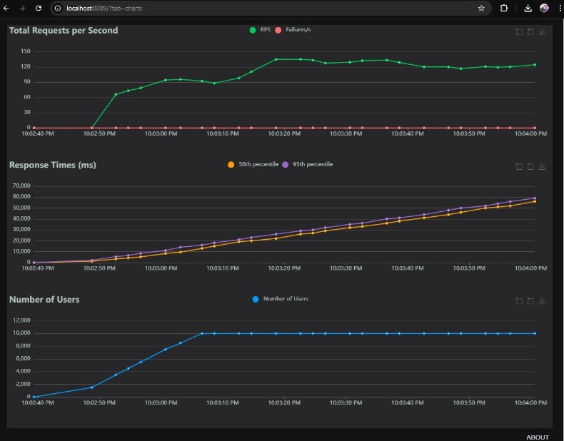
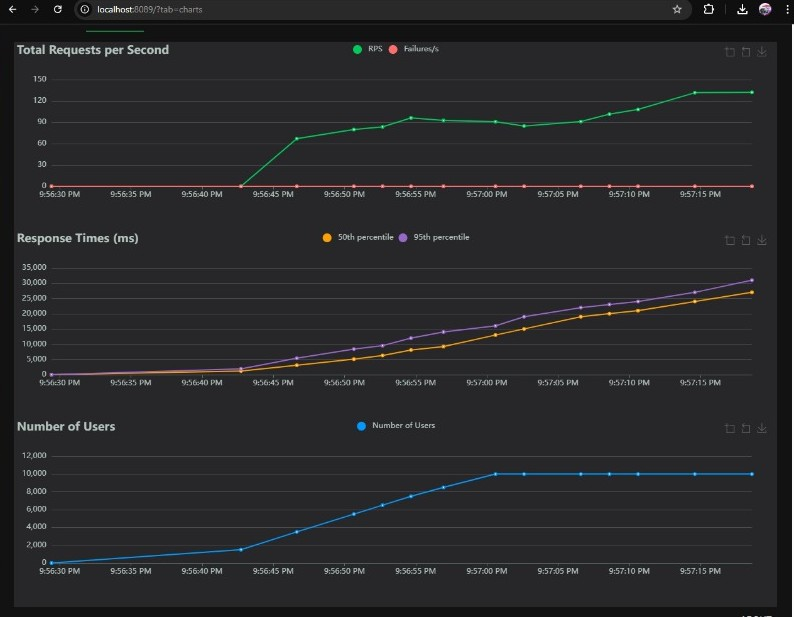
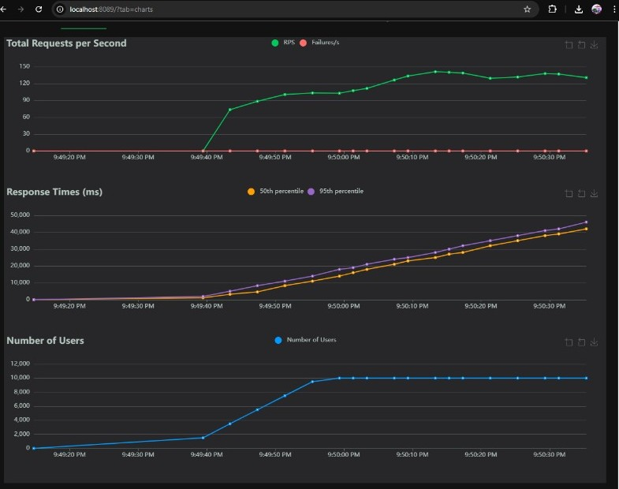
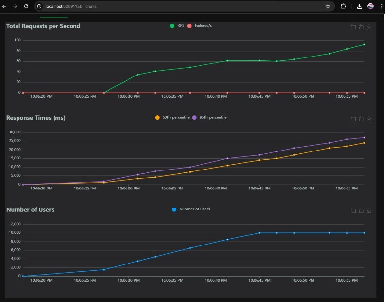
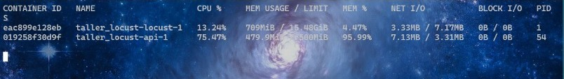
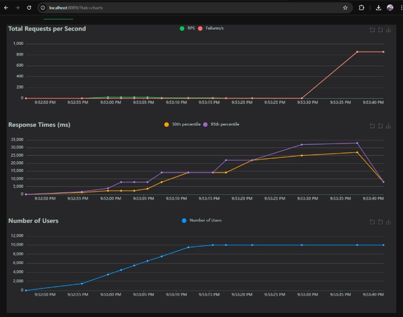

## Taller Locust:

## DESCRIPCIÓN

En este taller, se desarrolló y desplegó una API en FastAPI que permite realizar inferencia sobre un modelo previamente entrenado (RandomForest) y versionado con MLflow. La API se creó para contenerse en una imagen Docker publicada en DockerHub, y posteriormente, se sometió a pruebas de carga utilizando Locust. 

La finalidad de este taller, es la de identificar los recursos mínimos necesarios para soportar 10.000 usuarios concurrentes, y analizar el comportamiento al escalar el número de réplicas.

## ESTRUCTURA DEL PROYECTO

Componentes principales:
-	Contenedor FastAPI para inferencia.
-	Contenedor Locust para pruebas de carga.
-	Modelo .pkl cargado directamente.
-	Todos los servicios conectados mediante red Docker my_network.

Red personalizada my_network:
-	Declarada como red externa en ambos archivos docker-compose.
-	Permite la comunicación directa entre servicios definidos en archivos separados.
-	Se crea con: docker network create my_network

## IMPLEMENTACIÓN DEL TALLER

### API de inferencia con FastAPI

Se desarrolló una API con FastAPI contenida en el archivo main.py, que permite enviar un POST al endpoint /predict/ con las siguientes características:

-	Recibe 4 variables numéricas de entrada (longitud y profundidad del pico, largo de aletas, masa corporal).
-	Realiza predicciones con un modelo Random Forest serializado (random_forest_model.pkl).
-	Devuelve el sexo del pingüino como resultado (FEMALE o MALE).
-	Exposición del endpoint /predict/ para recibir predicciones POST.

El modelo se carga al inicio de la aplicación y se realiza validación de entrada con Pydantic.

### Imagen Docker de la API

Se construyó una imagen Docker que contiene la API, incluyendo el modelo entrenado. La imagen fue publicada en DockerHub bajo el nombre:

•	shadowmen2169/mlops:latest.
•	Dockerfile empaqueta el servicio FastAPI y el modelo.

### docker-compose.yaml para la API

Se configuró el archivo docker-compose.yaml para lanzar la API, limitando los recursos del contenedor docker-compose:

deploy:
  resources:
    limits:
      cpus: "0.75"
      memory: 500M

Este archivo levanta la imagen publicada en DockerHub y la expone en el puerto 8000.

### Pruebas de carga con Locust

Para realizar pruebas de carga, se configuró Locust con:

•	locustfile.py: simula peticiones válidas al endpoint /predict/ usando el cliente HttpUserlocustfile.
•	Dockerfile.locust: define la imagen Docker de pruebas.
•	docker-compose.locust.yaml: levanta Locust y lo conecta a la red de Dockerdocker-compose.locust.

Locust permite lanzar pruebas desde una interfaz web en el puerto 8089.

## METODOLOGÍA DE PRUEBAS DE CARGA

### Escenario planteado
•	Carga esperada: 10.000 usuarios concurrentes.
•	Crecimiento de usuarios: 500 usuarios por segundo.
•	Objetivo: encontrar la configuración mínima de CPU y RAM que permite soportar esta carga sin que el servicio colapse.

### Resultados de pruebas

1.	CPU: 4 - RAM: 500M

Con el comando docker stats, se observó lo siguiente:

2.	CPU: 2.5 - RAM: 1500M

Con el comando docker stats, se observó lo siguiente:

3.	CPU: 2 - RAM: 1000M

Con el comando docker stats, se observó lo siguiente:

4.	CPU: 0.75 - RAM: 500M

Con el comando docker stats, se observó lo siguiente:

5.	CPU: 0.5 - RAM: 100M

Con el comando docker stats, se observó lo siguiente:

### Conclusiones de las pruebas

•	Después de todas las pruebas realizadas, se concluyó que para la configuración de CPU: 0.5 y RAM: 100M, el servicio se saturaba y dejaba de responder y la gráfica de fallas comenzaba a incrementarse. Por lo tanto se descartó.

•	No obstante lo anterior, de todas las pruebas realizadas, con una configuración de CPU: 0.75 y RAM: 500 MB, la API logró atender 10.000 usuarios concurrentes con un tiempo de respuesta medio aceptable y sin errores de disponibilidad. Por lo cual, esta es la configuración que cumple uno de los objetivos planteados en el enunciado en el taller, el cual responde a la configuración de requisitos mínimos posible para que soporte 10.000 usuarios agregando 500 cada vez.

### Escalamiento horizontal

Para saber si se podrían reducir los recursos más del mínimo encontrado en el paso anterior, se realizaron pruebas disminuyendo progresivamente los recursos del contenedor. 

Al alcanzar el límite inferior de CPU: 0.5 RAM: 300M, comenzaron a registrarse fallos de respuesta y tiempos de espera prolongados. La respuesta de esta configuración se aprecia en la siguiente gráfica:

Con el comando docker stats, se observó lo siguiente:

Ahora bien, se incrementó el número de réplicas de la API a tres (3) en el docker-compose.yaml, con el código deploy:  replicas: 3, permitiendo distribuir la carga entre varios contenedores. A continuación se evidencia el resultado del escalamiento horizontal configurado:

Con el comando docker stats, se observó lo siguiente:

Al aumentar la replicas a 5, el resultado obtenido fue el siguiente:

Con el comando docker stats, se observó lo siguiente:

## CONCLUSIONES

•	Con 3 réplicas, fue posible reducir los recursos de cada contenedor a 0.5 CPU y 300 MB RAM, manteniendo estabilidad, con lo cual se responde al principal objetivo de este taller.

•	Se observó que el escalado es eficiente hasta cierto punto, pero agregar más réplicas sin cesar no aporta mejoras lineales.
